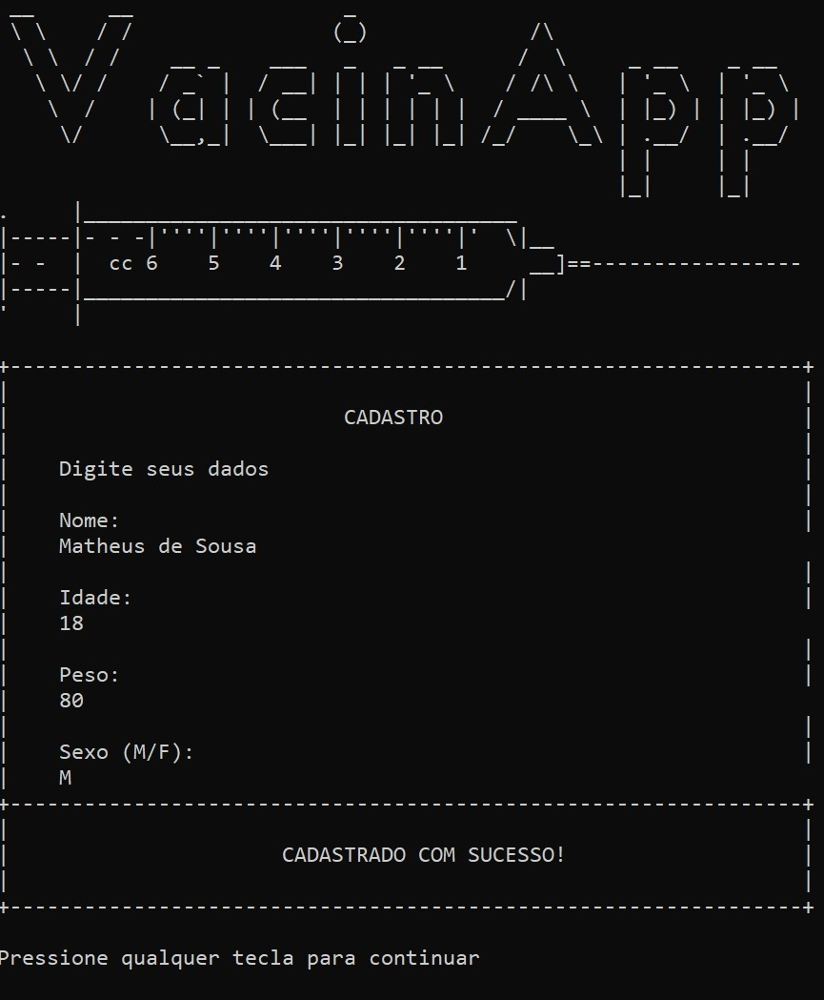
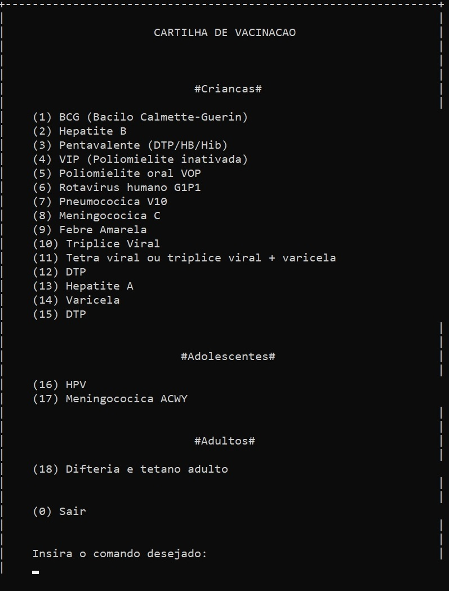

# VacinApp
VacinApp é um projeto em C++ que cadastra e exibe informações sobre vacinas para o usuário. Projeto realizado para a matéria de Algoritmos e Lógica de Programação do primeiro semestre do curso de Análise e desenvolvimento de sistema do IFSP.

Colaboradores: Aguinaldo Marcenes, Luis Brandão e Matheus de Sousa

### Imagens do projeto

<h3 align="center">
    
    
</h3>
